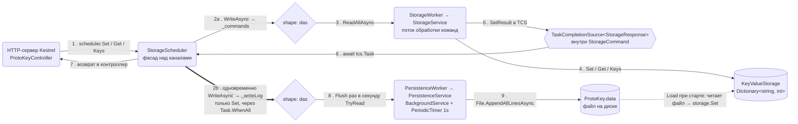

# Схема внутреннего устройства ProtoKey (с сохранением на диск)

```mermaid
graph LR
    A(HTTP-сервер Kestrel<br>ProtoKeyController)
    S(StorageScheduler<br>фасад над каналами)
    B[Channel&lt;StorageCommand&gt;<br>_commands]
    D(StorageWorker → StorageService<br>поток обработки команд)
    E[(KeyValueStorage<br>Dictionary&lt;string, int&gt;)]
    C{{TaskCompletionSource&lt;StorageResponse&gt;<br>внутри StorageCommand}}
    F[Channel&lt;SetCommand&gt;<br>_writeLog]
    G(PersistenceWorker → PersistenceService<br>BackgroundService + PeriodicTimer 1s)
    H[(ProtoKey.data<br>файл на диске)]

    B{ shape: das}
    F{ shape: das}

    A -->|1 . scheduler.Set / Get / Keys| S
    S -->|2a . WriteAsync → _commands| B
    S ==>|2b . одновременно WriteAsync → _writeLog<br>только Set, через Task.WhenAll| F
    B -->|3 . ReadAllAsync| D
    D -->|4 . Set / Get / Keys| E
    D -->|5 . SetResult в TCS| C
    C -->|6 . await tcs.Task| S
    S -->|7 . возврат в контроллер| A
    F -->|8 . Flush раз в секунду TryRead| G
    G -->|9 . File.AppendAllLinesAsync| H
    H -.->|Load при старте: читает файл → storage.Set| E
```