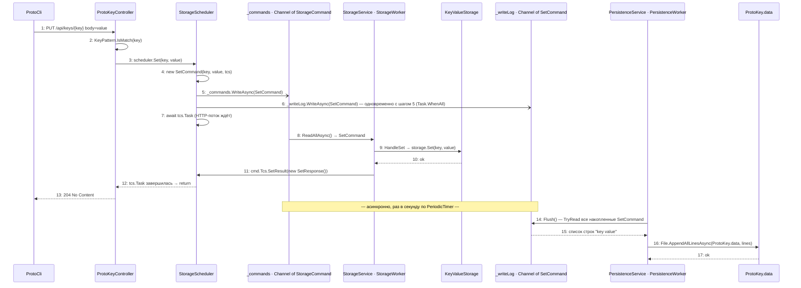

# UML Sequence: обработка команды set

```mermaid
sequenceDiagram
    participant CLI as ProtoCli
    participant Ctrl as ProtoKeyController
    participant Sch as StorageScheduler
    participant Cmd as _commands · Channel of StorageCommand
    participant Svc as StorageService · StorageWorker
    participant KV as KeyValueStorage
    participant WL as _writeLog · Channel of SetCommand
    participant PS as PersistenceService · PersistenceWorker
    participant File as ProtoKey.data

    CLI->>Ctrl: 1: PUT /api/keys/{key}  body=value
    Ctrl->>Ctrl: 2: KeyPattern.IsMatch(key)
    Ctrl->>Sch: 3: scheduler.Set(key, value)
    Sch->>Sch: 4: new SetCommand(key, value, tcs)
    Sch-)Cmd: 5: _commands.WriteAsync(SetCommand)
    Sch-)WL: 6: _writeLog.WriteAsync(SetCommand) — одновременно с шагом 5 (Task.WhenAll)
    Sch->>Sch: 7: await tcs.Task (HTTP-поток ждёт)

    Cmd->>Svc: 8: ReadAllAsync() → SetCommand
    Svc->>KV: 9: HandleSet → storage.Set(key, value)
    KV-->>Svc: 10: ok
    Svc->>Sch: 11: cmd.Tcs.SetResult(new SetResponse())
    Sch-->>Ctrl: 12: tcs.Task завершилась → return
    Ctrl-->>CLI: 13: 204 No Content

    note over Cmd,WL: --- асинхронно, раз в секунду по PeriodicTimer ---
    PS->>WL: 14: Flush() — TryRead все накопленные SetCommand
    WL-->>PS: 15: список строк "key value"
    PS->>File: 16: File.AppendAllLinesAsync(ProtoKey.data, lines)
    File-->>PS: 17: ok
```